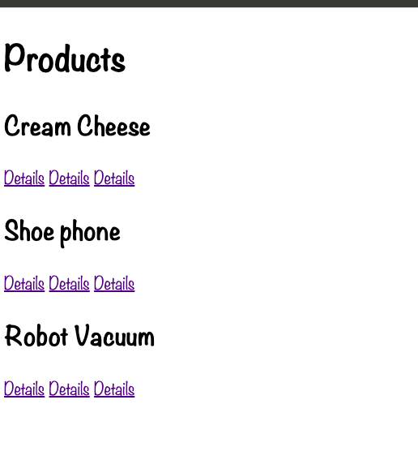

\# Rails routes basics. Tutorial by Kyle Geske's YouTube Channel

The basics of collection and member routing with one model and one controller. Covers routes.rb file, resources based routes, the link_to view helper, and more. 

* Ruby version: 3.0.0

* Rails version  7.0.4

1. Clone repository 
2. Navigate to the simple_store directory
3. Run "bundle install"
4. Run "rails s" 
5. Open your browser & enter "localhost:3000" in the address bar.
6. Happy coding!

